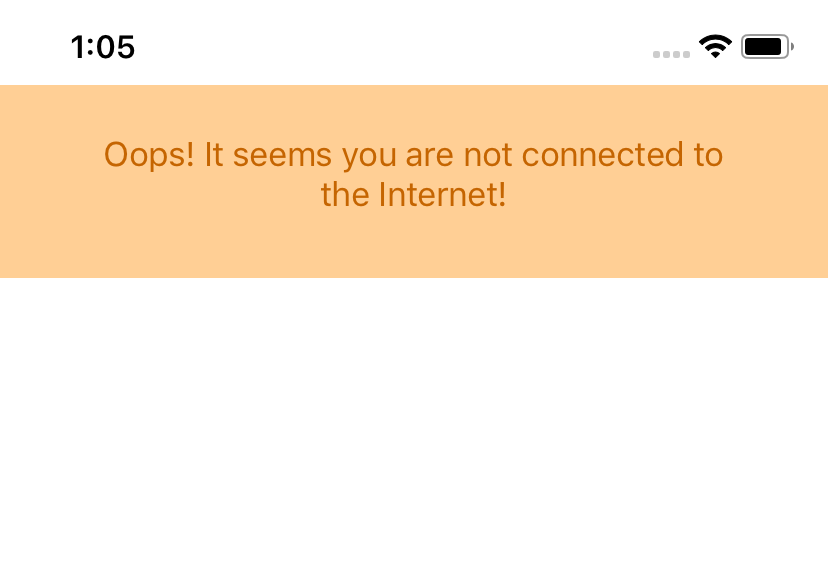

ToastKit
=============

ToastKit is a Swift extension that add a toast notification to `UIView` class.

Screenshot
---------



Usage
---------
```swift
// show the toast
self.view.showToast(embedding: ToastContentView.create())

// show the toast with a custom duration
self.view.showToast(embedding: ToastContentView.create(), duration: 0.4)

// hide the toast
self.view.hideToast()

// hide the toast with a custom duration
self.view.hideToast(duration: 0.4)
```


Setup Instructions
------------------

[CocoaPods](http://cocoapods.org)
------------------

To integrate Toast-Swift into your Xcode project using CocoaPods, specify it in your `Podfile`:

```ruby
pod 'ToastKit', :git => 'https://github.com/flexaddicted/ToastKit.git', :tag => '1.0.0'
```

and in your code add `import ToastKit`.

Manually
------------------

1. Add `UIView+ToastKit.swift` to your project.
2. Done :-)

Compatibility
------------------
* Version `1.x.x` requires Swift 4.2 and Xcode 10.

MIT License
-----------
    Copyright (c) 2018 Lorenzo Boaro.

    Permission is hereby granted, free of charge, to any person obtaining a
    copy of this software and associated documentation files (the
    "Software"), to deal in the Software without restriction, including
    without limitation the rights to use, copy, modify, merge, publish,
    distribute, sublicense, and/or sell copies of the Software, and to
    permit persons to whom the Software is furnished to do so, subject to
    the following conditions:

    The above copyright notice and this permission notice shall be included
    in all copies or substantial portions of the Software.

    THE SOFTWARE IS PROVIDED "AS IS", WITHOUT WARRANTY OF ANY KIND, EXPRESS
    OR IMPLIED, INCLUDING BUT NOT LIMITED TO THE WARRANTIES OF
    MERCHANTABILITY, FITNESS FOR A PARTICULAR PURPOSE AND NONINFRINGEMENT.
    IN NO EVENT SHALL THE AUTHORS OR COPYRIGHT HOLDERS BE LIABLE FOR ANY
    CLAIM, DAMAGES OR OTHER LIABILITY, WHETHER IN AN ACTION OF CONTRACT,
    TORT OR OTHERWISE, ARISING FROM, OUT OF OR IN CONNECTION WITH THE
    SOFTWARE OR THE USE OR OTHER DEALINGS IN THE SOFTWARE.
